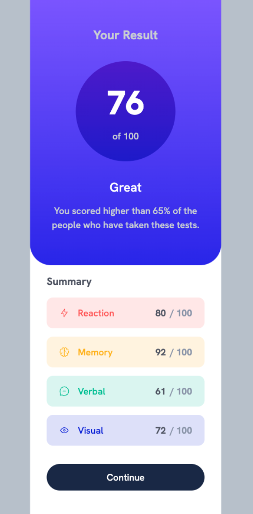
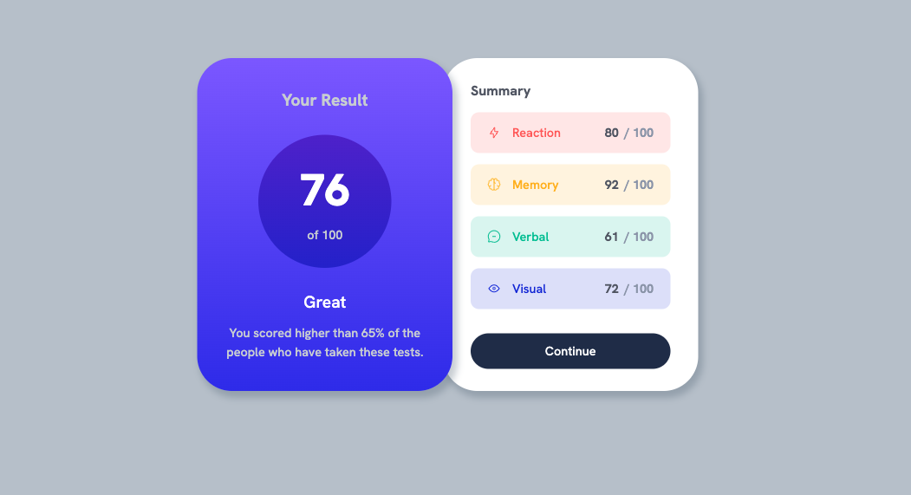

# Results Summary Component : Front End Mentors

## Welcome! 👋
This is my 2nd Front End Mentors Project. It was a bit of a challenge compared with the 1st project. 

## Some Challenges 
1. **Overlapping Content** Overlapping the summary card onto the bottom of the results card was a struggle. First I tried `position: relative`, but I found that in the mobile version, there would be a weird gap in the bottom of the top and bottom of the screen. I ended up with `margin-top: -1rem`. It felt hackish, but it works. 
2. **Spacing**  A lot of spacing even between the smaller parts of the UI. I felt like I used much more spacing declarations than was necessary. I tried to set up a consistent spacing system before the start of the project, but I felt as if I was using arbitrary numbers and judging things by my eye. In the future, I would like to try to use less declarations and make use of a spacing system. `.flow` class or `gap` property are really useful for this!
3. **Basic Syntax Errors**  I had a wrong semicolon in my CSS for the longest time, but couldn't understand why my site was breaking. Hopefully, I can get better and reduce making these silly mistakes. 
4. **Naming Classes**  When I had to incorporate `flex-direction: column`, I didn't know whether to add it to the component class or make another utility class. I ended up with `.flex-dir-col` which I feel like is an inelegant solution.

## Lessons
1. **Markdown Styling** I learned that you can use html and inline CSS within Markdown. I found this out while trying to center my image.
2. **Reinforcing Flexbox** I helped reinforce basic layout (`Flexbox`) and some edge cases such as when it won't align of the parent container not being big enough
